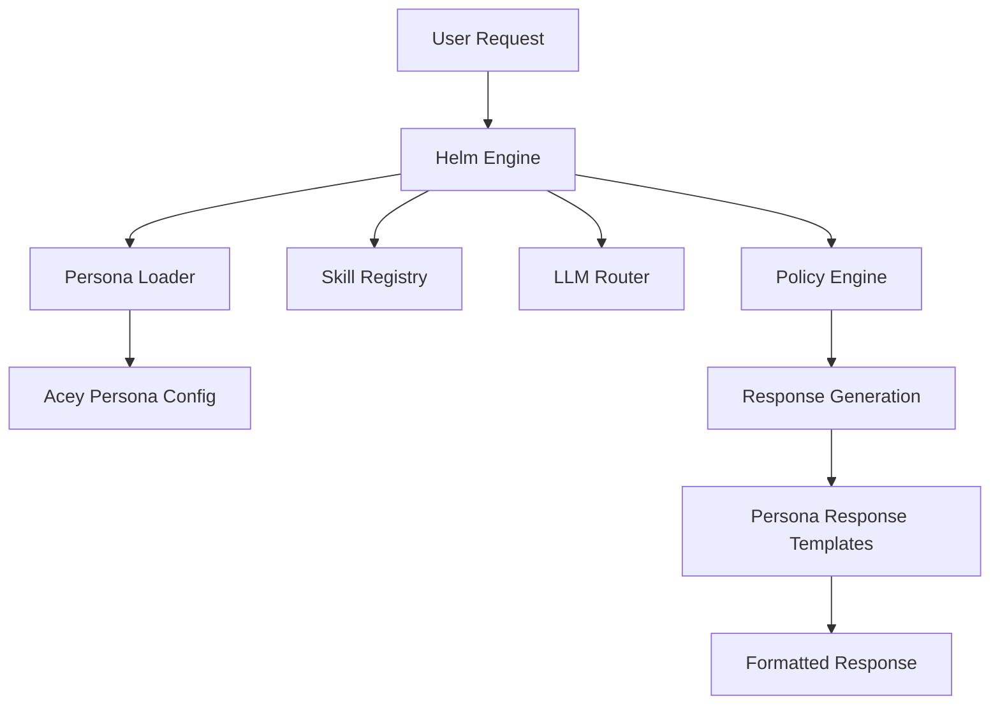

# 🏗️ HELM CONTROL ARCHITECTURE

## 📋 Overview

Helm Control is a white-label, enterprise-ready AI orchestration engine that separates the core technology from branded personas and specific applications. This architecture enables:

- **White-label licensing** for other platforms
- **Multiple persona support** with dynamic loading
- **Clean separation** between engine, persona, and application layers

## 🎯 Three-Layer Architecture

### **Layer 1: Helm Control Engine** (White-Label Product)
```
helm/
├─ orchestrator/          # Central coordination
│  ├─ helmOrchestrator.ts
│  ├─ intentRouter.ts
│  ├─ permissionGate.ts
│  └─ toolDispatcher.ts
├─ skills/               # Skill management
│  ├─ skillRegistry.ts
│  ├─ skillModule.ts
│  └─ permissionMatrix.ts
├─ llm/                  # LLM routing
│  ├─ llmRouter.ts
│  └─ llmValidator.ts
├─ security/             # Safety & permissions
│  ├─ policyEngine.ts
│  ├─ security.ts
│  └─ audit.ts
├─ memory/               # Data management
│  ├─ memoryEngine.ts
│  └─ provenance.ts
└─ personas/             # Persona loading
   └─ helmPersonaLoader.ts
```

**Purpose**: Core AI orchestration, skill management, LLM routing, safety enforcement

**Marketable As**: "Helm Control - Enterprise AI Orchestration Platform"

### **Layer 2: Persona System** (Configurable Personalities)
```
personas/
├─ acey/                 # Acey persona
│  ├─ persona-config.ts
│  ├─ prompts/
│  │  └─ system-prompt.md
│  └─ responses.json
├─ corporate-bot/        # Enterprise persona
│  ├─ persona-config.ts
│  └─ prompts/
└─ gaming-assistant/     # Gaming persona
   ├─ persona-config.ts
   └─ prompts/
```

**Purpose**: Branded personalities, tone, domain knowledge, response patterns

**Features**:
- Dynamic persona loading
- Configurable tone and personality
- Domain-specific knowledge
- Safety constraints per persona
- Response templates and validation

### **Layer 3: Application Layer** (Client Implementations)
```
apps/
├─ all-in-chat-poker/    # Flagship demo
│  ├─ game-logic/
│  ├─ twitch-integration/
│  └─ audio-engine/
├─ corporate-portal/      # Enterprise client
└─ gaming-platform/       # Gaming client
```

**Purpose**: Specific applications that use Helm Control engine

**Relationship**: Import Helm as dependency, configure persona, implement domain logic

## 🔄 Data Flow Architecture



## 🛡️ Security & Permission Architecture

### **Permission Matrix**
```typescript
interface PermissionMatrix {
  userRole: 'owner' | 'admin' | 'user' | 'guest';
  skillTier: 'basic' | 'pro' | 'enterprise';
  requiredPermissions: string[];
  humanOversight: string[];
}
```

### **Policy Engine**
- **Input Validation**: Sanitize and validate all inputs
- **Permission Checking**: Verify user permissions before execution
- **Safety Constraints**: Enforce persona-specific safety rules
- **Audit Logging**: Immutable logs for all actions

### **Multi-Tenant Isolation**
- **Data Separation**: Each tenant's data is isolated
- **Persona Isolation**: Personas cannot access other tenants' data
- **Resource Limits**: Per-tenant resource quotas

## 🎭 Persona System Architecture

### **Persona Configuration**
```typescript
interface PersonaConfig {
  personaName: string;
  domain: string;
  tone: ToneConfiguration;
  personality: PersonalityTraits;
  domainKnowledge: KnowledgeBase;
  safetyConstraints: SafetyRules;
  responses: ResponseTemplates;
}
```

### **Dynamic Loading**
```typescript
class HelmPersonaLoader {
  loadPersona(personaName: string): LoadedPersona
  generateResponse(personaName: string, type: string): string
  validateResponse(personaName: string, response: string): ValidationResult
}
```

### **Persona Features**
- **Configurable Tone**: Friendly, professional, technical, casual
- **Domain Knowledge**: Industry-specific expertise and limitations
- **Safety Rules**: Persona-specific constraints and oversight requirements
- **Response Templates**: Consistent personality in responses

## 🔧 Integration Architecture

### **API Integration**
```typescript
// Helm Engine API
interface HelmAPI {
  processMessage(request: UserMessage, persona: string): Promise<Response>
  executeSkill(skill: string, params: any, persona: string): Promise<any>
  validatePermissions(user: User, action: string): boolean
}
```

### **Client Integration**
```typescript
// Application uses Helm
import { HelmOrchestrator } from '@helm-control/engine';
import { helmPersonaLoader } from '@helm-control/personas';

const helm = new HelmOrchestrator();
const acey = helmPersonaLoader.getPersona('acey');
```

## 📊 Scalability Architecture

### **Horizontal Scaling**
- **Stateless Design**: Engine components are stateless where possible
- **Load Balancing**: Multiple engine instances behind load balancer
- **Caching**: Persona configurations and skill registry cached
- **Database**: Distributed database for audit logs and user data

### **Resource Management**
- **Memory Limits**: Per-request memory quotas
- **CPU Throttling**: Automatic throttling under load
- **Connection Limits**: Maximum concurrent requests per tenant
- **Skill Isolation**: Skills run in isolated contexts

## 🔍 Monitoring & Observability

### **Metrics Collection**
```typescript
interface HelmMetrics {
  requestCount: number;
  responseTime: number;
  errorRate: number;
  skillUsage: Record<string, number>;
  personaUsage: Record<string, number>;
  resourceUsage: ResourceMetrics;
}
```

### **Audit Trail**
- **Immutable Logs**: All actions logged with timestamps
- **Provenance Tracking**: Track data flow and transformations
- **Security Events**: Log all permission checks and violations
- **Performance Metrics**: Response times and resource usage

## 🚀 Deployment Architecture

### **Container Deployment**
```dockerfile
# Helm Control Engine
FROM node:18-alpine
COPY helm/ /app/helm/
EXPOSE 3000
CMD ["node", "/app/helm/index.js"]
```

### **Multi-Environment Support**
- **Development**: Local development with hot reload
- **Staging**: Pre-production testing environment
- **Production**: Enterprise-grade deployment
- **Demo**: Showcase environment with sample personas

## 📈 Business Model Architecture

### **Tier-Based Licensing**
```typescript
interface HelmTier {
  name: string;
  maxUsers: number;
  maxPersonas: number;
  maxSkills: number;
  features: string[];
  price: number;
}
```

### **White-Label Options**
- **Basic**: Single persona, limited skills
- **Professional**: Multiple personas, advanced skills
- **Enterprise**: Full customization, dedicated hosting

## 🔄 Migration Path

### **From Acey to Helm**
1. **Phase 1**: Extract engine logic to Helm namespace
2. **Phase 2**: Move persona logic to persona system
3. **Phase 3**: Update application integration
4. **Phase 4**: Remove old Acey engine code
5. **Phase 5**: Deploy Helm as white-label product

### **Compatibility**
- **API Compatibility**: Maintain backward compatibility during migration
- **Data Migration**: Tools to migrate existing configurations
- **Gradual Rollout**: Support both systems during transition

## 🎯 Success Metrics

### **Technical Metrics**
- **Response Time**: < 500ms for 95% of requests
- **Uptime**: > 99.9% availability
- **Error Rate**: < 0.1% error rate
- **Resource Efficiency**: < 100MB memory per instance

### **Business Metrics**
- **Adoption Rate**: Number of white-label installations
- **Persona Usage**: Active personas per deployment
- **Customer Satisfaction**: Support ticket volume and resolution time
- **Revenue**: License revenue and growth rate

---

## 📚 Next Steps

1. **Complete Engine Refactor**: Finish renaming all engine components
2. **Persona System Testing**: Test dynamic persona loading and switching
3. **Application Integration**: Update All-In Chat Poker to use Helm
4. **Documentation**: Complete API documentation and integration guides
5. **Testing**: Comprehensive testing of all three layers
6. **Deployment**: Set up production deployment pipeline

This architecture enables Helm Control to be a scalable, enterprise-ready AI orchestration platform while maintaining the flexibility to support multiple personas and applications.
