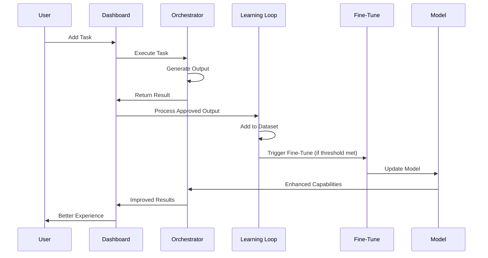

# 🚀 Acey Super-Development Roadmap

## 📊 Visual Architecture Diagram

```mermaid
graph TD
    A[User / Streamer<br/>Inputs & Overrides] --> B[Acey Control Center<br/>Dashboard + UI]
    
    B --> C[Audio Generation]
    B --> D[Code Generation] 
    B --> E[Images Generation]
    
    C --> F[Continuous Learning Loop<br/>- Approved outputs added to JSONL<br/>- Dataset growth tracked<br/>- Pending outputs queued for fine-tune]
    D --> F
    E --> F
    
    F --> G[Real-Time Fine-Tune<br/>- Trigger LLM API<br/>- Multi-task batches<br/>- Versioning & rollback]
    
    G --> H[Self-Evolving<br/>Acey<br/>(Improving<br/>Outputs)]
    
    H --> B
    
    style A fill:#e1f5fe
    style B fill:#f3e5f5
    style F fill:#fff3e0
    style G fill:#e8f5e8
    style H fill:#fce4ec
```

## 🏗️ System Architecture Overview

### **Phase 1: Input Layer**
- **User Interface**: Interactive dashboard for task management
- **Stream Integration**: Real-time input from streaming platforms
- **Override Controls**: Manual intervention and persona switching

### **Phase 2: Processing Layer**
- **Multi-Task Execution**: Parallel processing of audio, code, and images
- **Quality Assessment**: Real-time confidence and trust scoring
- **Intent Classification**: Automatic categorization and routing

### **Phase 3: Learning Layer**
- **Continuous Loop**: Automatic dataset curation
- **Fine-Tune Pipeline**: Real-time model improvement
- **Version Management**: Safe rollback and A/B testing

### **Phase 4: Evolution Layer**
- **Self-Improving**: Adaptive behavior based on usage
- **Persona Evolution**: Dynamic personality adjustment
- **Quality Enhancement**: Continuous output refinement

## 🔄 Data Flow Architecture



## 📈 Development Phases

### **Phase 1: Foundation (Week 1-2)**
- [ ] Core orchestrator implementation
- [ ] Basic dashboard UI
- [ ] Task type definitions
- [ ] Simple execution pipeline

### **Phase 2: Multi-Modal (Week 3-4)**
- [ ] Audio generation module
- [ ] Code generation module
- [ ] Image generation module
- [ ] Unified task interface

### **Phase 3: Intelligence (Week 5-6)**
- [ ] Continuous learning loop
- [ ] Dataset management
- [ ] Quality assessment
- [ ] Trust metrics

### **Phase 4: Evolution (Week 7-8)**
- [ ] Real-time fine-tuning
- [ ] Model versioning
- [ ] A/B testing framework
- [ ] Persona evolution

### **Phase 5: Enhancement (Week 9-10)**
- [ ] Advanced visualizations
- [ ] WebSocket integration
- [ ] Performance optimization
- [ ] Safety mechanisms

## 🧩 Module Connections

### **Core Dependencies**
```
AceyControlCenter
├── Orchestrator (core execution)
├── AudioCodingOrchestrator (specialized tasks)
├── ContinuousLearningLoop (dataset management)
├── RealTimeFineTune (model improvement)
└── Schema (type definitions)
```

### **Data Flow**
```
User Input → Dashboard → Orchestrator → Task Execution
                ↓
            Quality Assessment → Learning Loop → Dataset
                ↓
            Fine-Tune Trigger → Model Update → Enhanced Output
```

### **Feedback Loops**
1. **Immediate**: Task execution → Result preview
2. **Short-term**: Approved outputs → Dataset growth
3. **Medium-term**: Dataset threshold → Fine-tune trigger
4. **Long-term**: Model updates → Quality improvement

## 🎯 Key Integration Points

### **Dashboard ↔ Orchestrator**
- Task submission and status updates
- Real-time result streaming
- Configuration management

### **Orchestrator ↔ Learning Loop**
- Approved output forwarding
- Quality metadata sharing
- Performance metrics

### **Learning Loop ↔ Fine-Tune**
- Dataset batch preparation
- Fine-tune trigger conditions
- Model version coordination

### **Fine-Tune ↔ Model**
- API communication
- Parameter updates
- Version management

## 🔧 Technical Specifications

### **Performance Requirements**
- **Task Execution**: < 2 seconds average
- **Fine-Tune Trigger**: Every 20 approved outputs
- **Dataset Growth**: Track per task type
- **UI Responsiveness**: < 100ms interactions

### **Safety Mechanisms**
- **Shadow Banning**: Pre-deployment validation
- **Dry Run Mode**: Simulation without execution
- **Auto-Rule Evaluation**: Quality threshold enforcement
- **Rollback Capability**: Version control for models

### **Scalability Considerations**
- **Horizontal Scaling**: Multiple orchestrator instances
- **Dataset Partitioning**: Per-task-type storage
- **Caching Strategy**: Intelligent result caching
- **Load Balancing**: Distribute task execution

## 📊 Success Metrics

### **Technical KPIs**
- Task success rate > 95%
- Average processing time < 2s
- Fine-tune accuracy improvement > 10%
- System uptime > 99.5%

### **Quality KPIs**
- User satisfaction score > 4.5/5
- Output approval rate > 85%
- Trust score improvement > 15%
- Dataset quality score > 90%

### **Learning KPIs**
- Dataset growth rate > 50/month
- Fine-tune frequency > 1/week
- Model version success rate > 90%
- A/B test improvement rate > 20%

---

**Next Step**: Implement LLM Developer Prompt for automatic code generation
